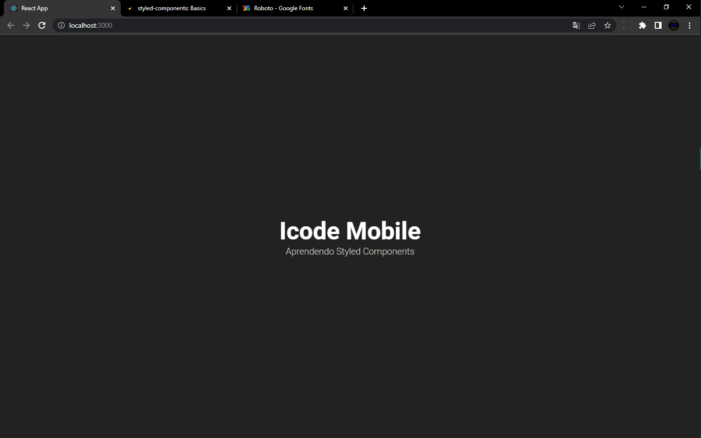

# Styled Components ReactJS

Usando a biblioteca Styled Components com ReactJS

<p align="center">

</p>

Para utilizar o repositório basta fazer o download do projeto ou clonar e dentro do projeto, abrir o terminal digitando o seguinte comando:

```bash
 yarn install
```

ou

```bash
 npm install
```

e assim que gerar a pasta node_modules, você roda o seguinte comando para ver a aplicação acontecendo:

```bash
  yarn start
```

ou

```bash
  npm start
```
